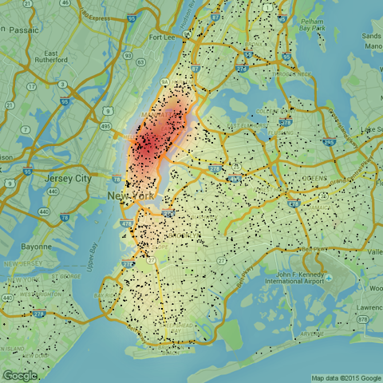

**Introduction**

This project explores the world of big data sets using the New York City Open Data repository. Specifically, we are looking at public safety violations across the entire city from 2007 to 2015, which is a 5 GB dataset containing over 10 million records. Using a remote server, our goal is to Geocode the data as best as we can, build a map containing the boundary of the 5 boroughs in New York City, and create a novel visualization of the data itself.

**Data Cleaning**

The NYC, Pluto, and Intersections dataset are all quite messy, so to start we had to clean it quite a bit. Some steps we took:

1. Change the name of the Intersections dataset from 'data' to 'Intersections' for easier coding readability.

2. Fix an error in the column name for 'Street1' in the Intersections Data

3. Only select the geographic column variables we need in the NYC Data. This step will reduce our future processing by a large factor, since we are removing data that we do not need in our analysis.

**Geocoding**

To geocode the NYC public safety dataset, we attempted to use two other datasets:

1. Intersections

This dataset contains all the intersections in New York City and their corresponding longitude and latitude.

Originally, our plan for geocoding with this dataset was the following:

Use the INNER_JOIN function in the 'dplyr' R package to find rows with matching intersections. Note that intersections could be coded in two different ways (1st Ave & A street *or* A street & 1st Ave), so we had to account for 4 different possibilities.

* Cross Street 1 & Street 1 - Cross Street 2 & Street 2
* Cross Street 2 & Street 1 - Cross Street 1 & Street 2
* Intersection Street 1 & Street 1 - Intersection Street 2 & Street 2
* Intersection Street 2 & Street 1 - Intersection Street 1 & Street 2

However, given that we are using the INNER_JOIN function on the 10 million record dataset 4 times, this is computationally expensive. Furthermore, it only resulted in 1000 unique geo-coded records, so we opted to skip the intersections data set entirely.

2. Pluto

This dataset contains all the taxable properties in New York City, their Borough, and the corresponding longitude and latitude.

Here, we used the INNER_JOIN function as above to find addresses matching in both datasets. However, it was very possible that addresses were repeated across and within boroughs, so we added a second limiting parameter to the Borough. Furthermore, if one address in the NYC data matched several in the Pluto data, we took the average of the latitudes and longitudes. Our reasoning for this was to decrease the standard error in choosing a latitude and longitude, as we only wanted one geo-coded point for each record.

This approach was quite successful, as we ultimately found over 700,000 unique matches from our NYC Dataset. To be clear, the Intersections joining method only found about 2000. I believe our success is due to the fact that we were only joining on 1 Address Column verses 2, and we also restricted Addresses to unique Boroughs.

**Borough Boundary**

Our final data frame included latitudes and longitudes of about 700k records, as well as their corresponding Borough. To create a map of the boundary of the Boroughs, we explored two different classification algorithms:

1. Support Vector Machine

This algorithm trains a non-linear hyperplane between the different Boroughs, given the longitudes and latitudes we have corresponding to the different classes. Unfortunately, the first iteration of this algorithm classified many points in the Ocean as being within a borough. This result brings up the question - how can we separate points not in any Borough from the Boroughs themselves?

It was a bit complicated to do this. We had to find longitudes and latitudes that does **not** correspond to any location points in our final data frame from the Geo-coding part. We took the pred_locs data frame resulting from the full raster object and rounded all the latitudes and longitudes to 3 digits. We did the same for our final data frame and performed an ANTI_JOIN from the 'dplyr' package to find all points in our pred_locs data frame that does not correspond to any Borough.

The SVM non-linear algorithm takes a long time to run, especially given the large number of records. As such, we limited the final data frame to 150k Borough Data, and another 50k non-Borough "Other" points, randomly sampled from both results. After r-binding these data frames together, we ran the SVM algorithm to create a classification hyper plane.

We found that the final result did well in some Boroughs but poorly in other Boroughs (specifically, Staten Island), which led us to believe that the 150k records in the Data over emphasized some Boroughs over others. Indeed this was true, as Staten Island only had 10k records, whereas Manhattan had 40k. 

For the purpose of creating a boundary, we re-created the data frame as above, but specifically took 30k records from each Borough, so they would be represented equally. The final result, pictured below, seemed to work pretty well.

2. Alpha Hull

Our next attempt was using the alpha hull algorithm to create a boundary around the Borough points. After some tweaking of our parameter value, we created very tight boundaries around each Borough, when plotted together, looks like a very accurate representation of New York City.

The challenge here was to take these alpha hull objects and transform them into a Spatial Polygons Dataframe. Using Colin's help, we created a function to transform this alpha hull object to a spatial polygon, but we were unable to get good results without a very high alpha value. Even so, we found that we were compromising the accuracy of our final result just to get the Spatial Polygons object out.

Under these circumstances, we opted to stick with our SVM classification mapping technique. We did not include any alpha hull code in our respository.

**Visualization**

For our visualization, we looked at the complaint type of each public safety record, and focused on the one specific complaint type of 'traffic'. Here is what we did to get the following visualization:

1. Subsetted complaints whose type if traffic from the original data frame. 
2. Plotted those corresponding coordinates on a map of NYC
3. Drew a geographic heat map, where the red part represents the most dense complaints of traffic.

As we can see most of these complaints concentrate in Manhattan, which tells us that either Manhattan contains the most traffic out of all the Boroughs, or people in Manhattan are more likely to issue a complaint than in other Boroughs. The visualization itself is quite fantastic !

Note: We used the following [help page](https://github.com/mylesmharrison/TO_trafficsignals_heatmap) to assist with our heatmap.

**Conclusion**

In conclusion, this was a challenging project, exploring the world of big data. We learned that it is important to be intelligent about how you subset and gather the data, being careful of the amount of memory and disk space used. We further learned how useful Support Vector Machines, Alpha Hulls, and Heatmap visualizations can be when working with data.